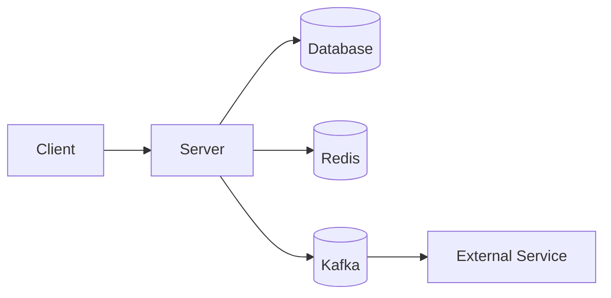
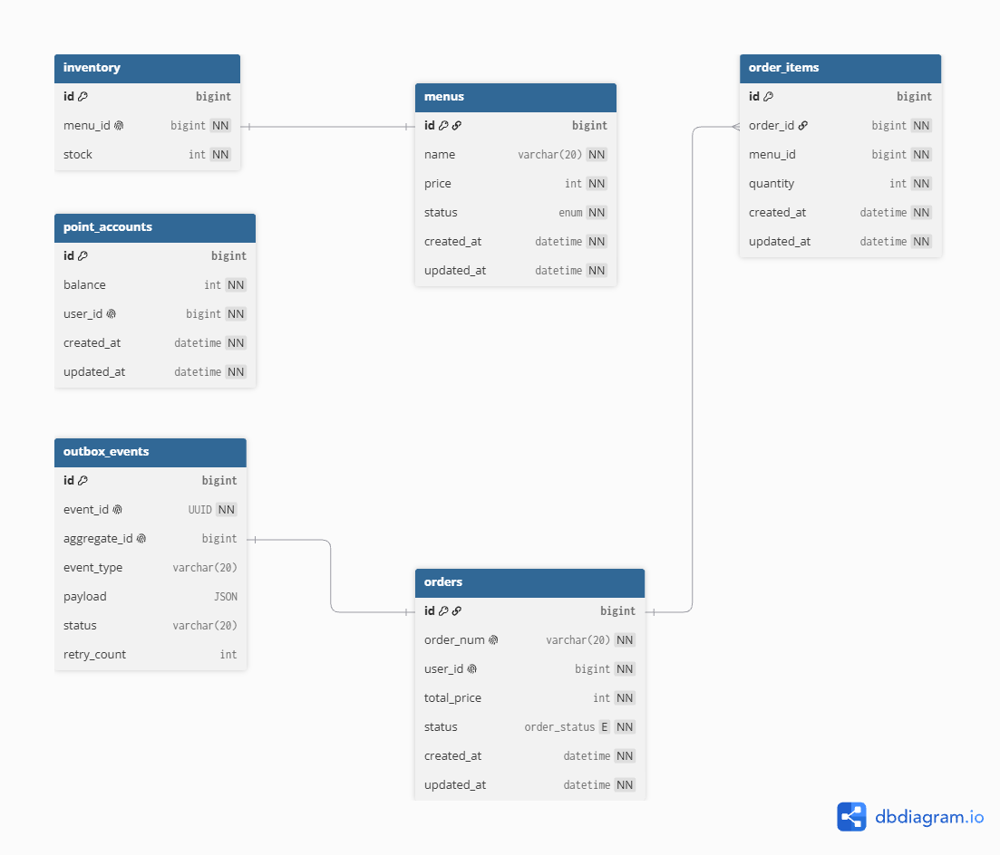

# cafe API

> 다수의 서버 환경에서도 안정적으로 동작하는 것을 목표로 한 커피숍 주문 시스템

---

## 목차

- [주요 기능](#주요-기능)
- [기술 스택](#기술-스택)
- [시스템 아키텍처](#시스템-아키텍처)
- [ERD](#erd)
- [프로젝트 구조](#프로젝트-구조)
- [주요 설계](#주요-설계)
- [테스트](#테스트)
- [실행 방법](#실행-방법)
- [향후 개선 사항](#향후-개선-사항)

---

## 주요 기능

### 메뉴

- 커피 정보 조회

### 포인트

- 포인트 충전

### 주문

- 주문 생성

### 인기 메뉴 조회

- 최근 7일간의 인기 메뉴 조회

---

## 기술 스택

### Backend

- Java
- Spring Boot
- Spring Security
- Spring Data MySQL / JPA
- Redis
- Kafka

### Database

- MySQL

### Infrastructure

- Docker
- Docker Compose

### Test

- JUnit
- Mockito
- Testcontainers

---

## 시스템 아키텍처



### 아키텍처 설계

- DDD 적용으로 Domain의 상태 변경을 Domain 내부에서 처리
- Clean Architecture를 적용하여 Domain과 Infrastructure 의존성 분리
- Domain, Application, Infra 계층을 분리하여 내부 계층이 외부 계층에 의존하지 않도록 설계

---

## ERD


---

## 프로젝트 구조

```text
src
├── main
│   └── java
│       └── com.example.project
│           ├── common
│           ├── inventory
│           ├── menu
│           ├── order
│           ├── outbox
│           ├── point
│           └── ranking
│
└── test
    └── java
        └── com.example.project
```

### 패키지 역할

| 패키지         | 역할                                          |
|-------------|---------------------------------------------|
| `common`    | 공통 예외 처리 및 redis, kafka 등 설정                |
| `inventory` | 재고 도메인 엔티티 및  도메인, 애플리케이션 로직 등              |
| `menu`      | 메뉴 도메인 엔티티 및  도메인, 애플리케이션 로직 등              |
| `order`     | 주문 도메인 엔티티 및  도메인, 애플리케이션 로직 등              |
| `outbox`    | 외부 데이터 수집 플랫폼에 전송할 데이터 원장 관리 및 kafka를 통한 전송 |
| `point`     | 포인트 도메인 엔티티 및  도메인, 애플리케이션 로직 등             |
| `ranking`   | redis를 활용해 최근 7일 간의 주문량 랭킹 조회               |

---

## 주요 설계

### 1. 도메인 설계

- 메뉴와 재고는 생명주기가 같으나 변경 시점이 다르므로 각각 다른 도메인으로 분리
- 주문 도메인 내부에 OrderItem 엔티티를 내장하여 주문 내역 관리

```text
Menu
Inventory
Point
Order
 └── OrderItem
```

### 2. 외부 시스템 추상화

Redis와 Kafka에 직접 의존하지 않도록 인터페이스를 사용했습니다.

```java
public interface RankingCacheService {
    void increaseMenusRanking(List<Long> menuIds);
    List<Long> findMenuRankingTop3In7Days();
}
```

구체적인 구현은 Infrastructure에서 담당합니다.

```text
Application
     │
     ▼
RankingCacheService
     ▲
     │
RankingRedisCacheService
```

### 3. 동시성 처리

동시에 동일한 자원에 접근하는 상황에서 발생할 수 있는 문제를 해결하기 위해 다음과 같은 방법을 사용했습니다.

- 분산 락
- 비관적 락

> 다수의 인스턴스를 실행하는 것을 상정하고 있으므로 다수의 인스턴스에서도 문제가 되지 않도록 분산락을 적용했습니다.

---

## 테스트

### 테스트 전략

각 도메인 로직과 application 계층, api에 대한 단위/슬라이스 테스트를 진행했습니다.
또한, test container로 동시성 및 redis, kafka 테스트를 진행했습니다.

- 단위 테스트
- 통합 테스트
- API 테스트
- 동시성 테스트

### 테스트 예시

```java
@Test
void 주문_생성에_성공한다() {
    // given

    // when

    // then
}
```

### 테스트 결과

| 테스트      | 결과 |
|----------|---|
| 커피 정보 조회 | ✅ |
| 주문 생성    | ✅ |
| 인기 메뉴 조회 | ✅ |
| 포인트 충전   | ✅ |
| 동시성 테스트  | ✅ |

---

## 실행 방법

### 1. 프로젝트 Clone

```bash
git clone https://github.com/xevbn/cafe.git
cd cafe
```

### 2. Docker 실행

```bash
docker compose up -d
```

---

## API 문서

### Swagger

```text
http://localhost:8080/swagger-ui/index.html
```

### 주요 API

| Method | Endpoint               | 설명       |
|--------|------------------------|----------|
| GET    | `/api/menus`           | 커피 메뉴 조회 |
| POST   | `/api/orders`          | 주문 생성    |
| POST   | `/api/points/{userId}` | 포인트 충전   |
| GET    | `/api/ranking`         | 인기 메뉴 조회 |

---

## 향후 개선 사항

현재 구현에서 개선할 수 있는 부분을 작성합니다.

- 실제 결제 로직 추가
- 계정 기능 추가

---

## 기술적 의사결정

| 기술     | 선택 이유                               |
|--------|-------------------------------------|
| Redis  | Redis의 ZSET으로 인기 메뉴를 조회             |
| Kafka  | 외부 데이터 수집 플랫폼에 주문 이벤트를 손실없이 전송하기 위함 |

## 설계 의도

| 관점    | 핵심 질문                  | 설계 원칙                                         | 적용 지점                |
|-------|------------------------|-----------------------------------------------|----------------------|
| 확장성   | 인스턴스가 여러 개여도 똑같이 작동하는가 | 인스턴스 1를 전제로 하지 않고 분산 락, 유니크 제약, 이벤트 기반 처리를 적용 | 주문 생성 로직 및 재고/포인트 차감 |
| 동시성   | 동시에 발생한 요청중 하나만 반영돼야 하는 지점은 어디인가 | 필요한 지점만 락을 걸을 적용                              | 포인트 및 재고 차감          | 
| 장애 처리 | kafka에 이벤트 발행에 실패하면 어떻게 되는가 | outbox 패턴을 적용해 이벤트 발행에 실패해도 다시 발행할 수 있도록 적용   | 외부 데이터 수집 플랫폼에 전송    |

---

## 회고

DDD 및 클린 아키텍처를 적용하려다 보니 실제 기능 사항이 미흡합니다.
최대한 위 사항들을 적용해보려 했으나 잘 적용됐는지 의문이 듭니다..

하지만 redis/kafka 같은 외부 의존성을 분리함으로 기술 변경에 대해 유연하게 대응할 수 있도록 설계하고 각 계층을 최대한 분리하여 결합도를 낮췄습니다.

### 배운 점

- Redisson 라이브러리 및 aop를 사용한 분산 락 적용
- DDD 방식의 설계

### 아쉬웠던 점

- redis/kafka 등의 장애 발생 시 대응 미흡
- 주요 로직에 대한 기능 사항 미흡

### 개선 방향

- redis나 kafka에 장애가 발생할 경우에 대한 처리
- kafka DLT 로직 추가
- 멱등성 추가
- 실제 결제 시스템, 사용자 시스템 등의 추가
