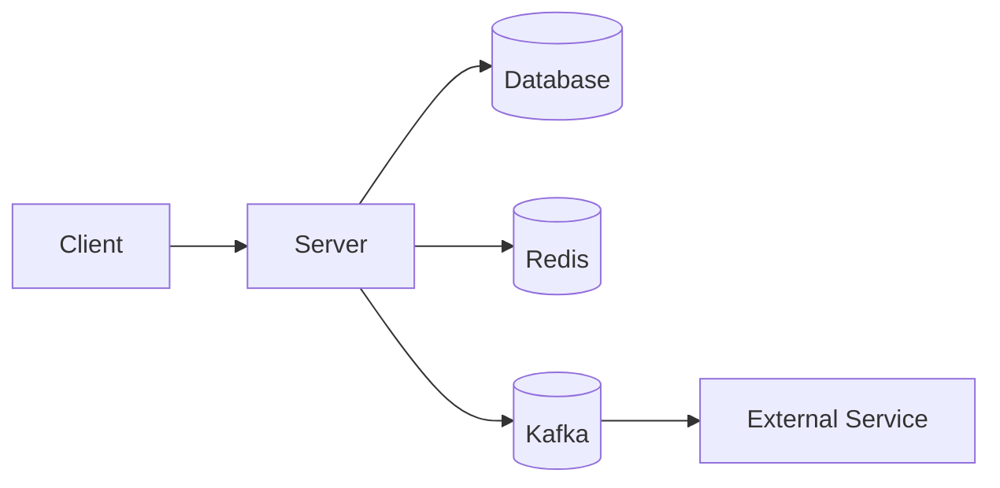

# 프로젝트 이름

> 프로젝트를 한 문장으로 설명합니다.

프로젝트에 대한 간단한 소개를 작성합니다.

- 개발 기간: `2026.09.28 ~ 2026.09.07`
- 개발 인원: `1명`
- 프로젝트 목적: 
- 배포: 배포 여부 및 URL

---

## 목차

- [프로젝트 소개](#프로젝트-소개)
- [주요 기능](#주요-기능)
- [기술 스택](#기술-스택)
- [시스템 아키텍처](#시스템-아키텍처)
- [ERD](#erd)
- [프로젝트 구조](#프로젝트-구조)
- [주요 설계](#주요-설계)
- [트러블슈팅](#트러블슈팅)
- [테스트](#테스트)
- [실행 방법](#실행-방법)
- [향후 개선 사항](#향후-개선-사항)

---

## 프로젝트 소개

### 배경

해당 프로젝트는 실시간 데이터 처리 및 동시성

> 어떤 문제가 있었고, 왜 이 프로젝트를 만들었는가?

### 목표

프로젝트를 통해 해결하고자 하는 문제와 기술적인 목표를 작성합니다.

-
-
-

---

## 주요 기능

### 회원

- 회원가입
- 로그인 / 로그아웃
- 인증 / 인가
- 회원 정보 조회

### 상품

- 상품 등록
- 상품 조회
- 상품 수정
- 상품 삭제

### 주문

- 주문 생성
- 주문 조회
- 주문 취소

### 결제

- 결제 요청
- 결제 승인
- 결제 취소
- 결제 상태 동기화

> 실제 프로젝트에서 구현한 기능만 작성합니다.

---

## 기술 스택

### Backend

- Java
- Spring Boot
- Spring Security
- Spring Data MySQL / JPA
- Redis
- Kafka

### Database

- MySQL

### Infrastructure

- Docker
- Docker Compose
- AWS

### Test

- JUnit
- Mockito
- Testcontainers

---

## 시스템 아키텍처



### 아키텍처 설계

프로젝트에서 어떤 아키텍처를 사용했는지 설명합니다.

예:

- Domain과 Infrastructure의 의존성 분리
- 비즈니스 로직과 기술 구현의 분리

---

## ERD

```text
ERD 이미지 또는 링크
```


---

## 프로젝트 구조

```text
src
├── main
│   └── java
│       └── com.example.project
│           ├── domain
│           ├── application
│           ├── infrastructure
│           └── global
│
└── test
    └── java
        └── com.example.project
```

### 패키지 역할

| 패키지 | 역할 |
|---|---|
| `domain` | 핵심 비즈니스 규칙과 도메인 객체 |
| `application` | 유스케이스 및 애플리케이션 흐름 |
| `infrastructure` | DB, 외부 API 등 기술 구현 |
| `global` | 공통 설정 및 예외 처리 |

---

## 주요 설계

### 1. 도메인 설계

프로젝트에서 중요하게 생각한 도메인 모델과 설계 원칙을 설명합니다.

```text
예시

Order
 ├── OrderItem
 └── Payment
```

### 2. 외부 시스템 추상화

외부 시스템에 직접 의존하지 않도록 인터페이스를 사용했습니다.

```java
public interface PaymentGateway {

    PaymentGatewayResponse getPayment(String paymentId);

    void cancelPayment(String paymentId);
}
```

구체적인 구현은 Infrastructure에서 담당합니다.

```text
Application
     │
     ▼
PaymentGateway
     ▲
     │
PortOnePaymentGateway
```

### 3. 동시성 처리

동시에 동일한 자원에 접근하는 상황에서 발생할 수 있는 문제를 해결하기 위해 다음과 같은 방법을 사용했습니다.

- 분산 락
- 트랜잭션
- 낙관적 락 / 비관적 락
- 원자적 연산

> 실제로 적용한 방식과 적용 이유를 작성합니다.

---

## 트러블슈팅

프로젝트에서 발생한 문제와 해결 과정을 작성합니다.

### 문제 1. 문제 제목

#### 문제

어떤 상황에서 문제가 발생했는지 작성합니다.

#### 원인

문제의 원인을 분석한 내용을 작성합니다.

#### 해결

어떤 방법으로 해결했는지 작성합니다.

#### 결과

해결 이후 어떤 변화가 있었는지 작성합니다.

---

### 문제 2. 문제 제목

#### 문제

...

#### 원인

...

#### 해결

...

#### 결과

...

---

## 테스트

### 테스트 전략

프로젝트의 테스트 전략을 작성합니다.

- 단위 테스트
- 통합 테스트
- API 테스트
- 동시성 테스트
- 외부 API Mock 테스트

### 테스트 예시

```java
@Test
void 결제_승인에_성공한다() {
    // given

    // when

    // then
}
```

### 테스트 결과

| 테스트 | 결과 |
|---|---|
| 회원가입 | ✅ |
| 로그인 | ✅ |
| 주문 생성 | ✅ |
| 결제 승인 | ✅ |
| 결제 취소 | ✅ |

---

## 실행 방법

### 1. 프로젝트 Clone

```bash
git clone <repository-url>
cd <project-name>
```

### 2. 환경 변수 설정

```env
DB_URL=
DB_USERNAME=
DB_PASSWORD=

REDIS_HOST=
REDIS_PORT=

JWT_SECRET=
```

### 3. Docker 실행

```bash
docker compose up -d
```

### 4. 애플리케이션 실행

```bash
./gradlew bootRun
```

---

## API 문서

### Swagger

```text
Swagger URL
```

### 주요 API

| Method | Endpoint | 설명 |
|---|---|---|
| POST | `/api/auth/login` | 로그인 |
| POST | `/api/users` | 회원가입 |
| GET | `/api/products` | 상품 조회 |
| POST | `/api/orders` | 주문 생성 |
| POST | `/api/payments` | 결제 승인 |

---

## 향후 개선 사항

현재 구현에서 개선할 수 있는 부분을 작성합니다.

-
-
-

---

## 기술적 의사결정

프로젝트에서 중요한 기술 선택과 그 이유를 정리합니다.

| 기술 | 선택 이유 |
|---|---|
| Redis | |
| Kafka | |
| Docker | |
| Spring Security | |

자세한 내용은 아래 문서에서 확인할 수 있습니다.

- [Redis 도입 이유](docs/redis.md)
- [동시성 제어](docs/concurrency.md)
- [인증/인가 설계](docs/security.md)

---

## 회고

프로젝트를 진행하면서 배운 점과 아쉬웠던 점을 작성합니다.

### 배운 점

-
-
-

### 아쉬웠던 점

-
-

### 개선 방향

-
- 